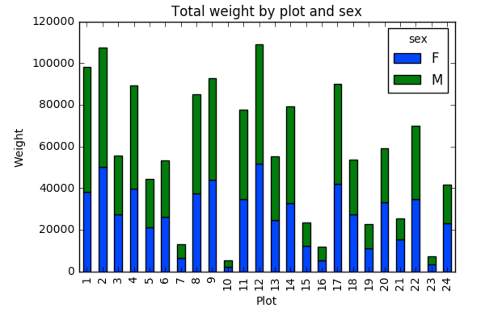

# Working With Pandas DataFrames in Python

We can automate the process above using Python. It's efficient to spend time
building the code to perform these tasks because once it's built, we can use it
over and over on different datasets that use a similar format. This makes our
methods easily reproducible. We can also easily share our code with colleagues
and they can replicate the same analysis.

### Starting in the same spot

To help the lesson run smoothly, let's ensure everyone is in the same directory.
This should help us avoid path and file name issues. At this time please
navigate to the workshop directory. If you working in IPython Notebook be sure
that you start your notebook in the workshop directory.

A quick aside that there are Python libraries like [OS
Library](https://docs.python.org/3/library/os.html) that can work with our
directory structure, however, that is not our focus today.

### Our Data

For this lesson, we will be using the Cushman Collection metadata
[which is available on GitHub](https://github.com/caltechlibrary/) 
[The origional version](https://github.com/iulibdcs/cushman_photos)
was encoded by excel and is therefore challenging to work with in pandas.
We re-encoded the file by saving it in Excel as an xlsx and when using the
xlsx2csv tool that is part of the
[datatools](https://caltechlibrary.github.io/datatools/) package.


We are studying the metadata from a photography collection. 
The dataset is stored as a `.csv` file: each row holds information for a
single photo, and the columns represent information about the photo.
We already looked through this file in OpenRefine.

---

## About Libraries
A library in Python contains a set of tools (called functions) that perform
tasks on our data. Importing a library is like getting a piece of lab equipment
out of a storage locker and setting it up on the bench for use in a project.
Once a library is set up, it can be used or called to perform many tasks.

## Pandas in Python
One of the best options for working with tabular data in Python is to use the
[Python Data Analysis Library](http://pandas.pydata.org/) (a.k.a. Pandas). The
Pandas library provides data structures, produces high quality plots with
[matplotlib](http://matplotlib.org/) and integrates nicely with other libraries
that use [NumPy](http://www.numpy.org/) (which is another Python library) arrays.

Python doesn't load all of the libraries available to it by default. We have to
add an `import` statement to our code in order to use library functions. To import
a library, we use the syntax `import libraryName`. If we want to give the
library a nickname to shorten the command, we can add `as nickNameHere`.  An
example of importing the pandas library using the common nickname `pd` is below.


```python
import pandas as pd
```

Each time we call a function that's in a library, we use the syntax
`LibraryName.FunctionName`. Adding the library name with a `.` before the
function name tells Python where to find the function. In the example above, we
have imported Pandas as `pd`. This means we don't have to type out `pandas` each
time we call a Pandas function.


# Reading CSV Data Using Pandas

We will begin by locating and reading our survey data which are in CSV format.
We can use Pandas' `read_csv` function to pull the file directly into a
[DataFrame](http://pandas.pydata.org/pandas-docs/stable/dsintro.html#dataframe).

## So What's a DataFrame?

A DataFrame is a 2-dimensional data structure that can store data of different
types (including characters, integers, floating point values, factors and more)
in columns. It is similar to a spreadsheet or an SQL table or the `data.frame` in
R. A DataFrame always has an index (0-based). An index refers to the position of
an element in the data structure.

```python
# note that pd.read_csv is used because we imported pandas as pd
pd.read_csv("cushman_encoded.csv")
```

The above command yields **output** that shows a summary of the file contents.

We can see that there were 15,190 rows parsed. Each row has 90
columns. The first column is the index of the DataFrame. The index is used to
identify the position of the data, but it is not an actual column of the DataFrame.
It looks like  the `read_csv` function in Pandas  read our file properly. However,
we haven't saved any data to memory so we can work with it.We need to assign the
DataFrame to a variable. Remember that a variable is a name for a value, such as `x`,
or  `data`. We can create a new  object with a variable name by assigning a value to it using `=`.

Let's call the imported data `cushman_df`:

```python
cushman_df = pd.read_csv("cushman_encoded.csv")
```

Notice when you assign the imported DataFrame to a variable, Python does not
produce any output on the screen. We can print the value of the `cushman_df`
object by typing its name into the Python command prompt.

```python
cushman_df
```

which prints contents like above

## Manipulating Our Species Survey Data

Now we can start manipulating our data. First, let's check the data type of the
data stored in `cushman_df` using the `type` method. **The `type` method and
`__class__` attribute** tell us that `cushman_df` is `<class 'pandas.core.frame.DataFrame'>`.

```python
type(cushman_df)
# this does the same thing as the above!
cushman_df.__class__
```
We can also enter `cushman_df.dtypes` at our prompt to view the data type for each
column in our DataFrame. `int64` represents numeric integer values - `int64` cells
can not store decimals. `object` represents strings (letters and numbers). `float64`
represents numbers with decimals.

	cushman_df.dtypes

which returns information about the different types for each column.

We'll talk a bit more about what the different formats mean in a different lesson.

### Useful Ways to View DataFrame objects in Python

There are many ways to summarize and access the data stored in DataFrames,
using attributes and methods provided by the DataFrame object.

To access an attribute, use the DataFrame object name followed by the attribute
name `df_object.attribute`. Using the DataFrame `cushman_df` and attribute
`columns`, an index of all the column names in the DataFrame can be accessed
with `cushman_df.columns`.

Methods are called in a similar fashion using the syntax `df_object.method()`.
As an example, `survey_df.head()` gets the first few rows in the DataFrame
`survey_df` using **the `head()` method**. With a method, we can supply extra
information in the parens to control behaviour.

Let's look at the data using these.

> ## Challenge - DataFrames
>
> Using our DataFrame `cushman_df`, try out the attributes & methods below to see
> what they return.
>
> 1. `cushman_df.columns`
> 2. `cushman_df.shape` Take note of the output of `shape` - what format does it
>    return the shape of the DataFrame in?
>    
>    HINT: [More on tuples, here](https://docs.python.org/3/tutorial/datastructures.html#tuples-and-sequences).
> 3. `cushman_df.head()` Also, what does `cushman_df.head(15)` do?
> 4. `cushman_df.tail()`
{: .challenge}


## Calculating Statistics From Data In A Pandas DataFrame

We've read our data into Python. Next, let's perform some quick summary
statistics to learn more about the data that we're working with. We might want
to know how many animals were collected in each plot, or how many of each
species were caught. We can perform summary stats quickly using groups. But
first we need to figure out what we want to group by.

Let's begin by exploring our data:

```python
# Look at the column names
cushman_df.columns.values
```

Let's get a list of all the roll IDs. The `pd.unique` function tells us all of
the unique values in the `Roll ID` column.

```python
pd.unique(cushman_df['Roll ID'])
```

Let's put those numbers in order

```python
sorted(pd.unique(cushman_df['Roll ID'])
```

> ## Challenge - Statistics
>
> 1. Create a list of unique years found in the surveys data. Call it
>   `years`. 
>
> 2. How many years were pictures taken?
{: .challenge}

# Groups in Pandas

We often want to calculate summary statistics grouped by subsets or attributes
within fields of our data. For example, we might want to calculate the average
weight of all individuals per plot.

We can calculate basic statistics for all records in a single column using the
syntax below:

```python
cushman_df['Roll number'].describe()
```
gives **output**

```python
count    15190.000000
mean        11.529032
std          8.092171
min          0.000000
25%          5.000000
50%         10.000000
75%         17.000000
max         40.000000
Name: Roll number, dtype: float64
```

We can also extract one specific metric if we wish:

```python
cushman_df['Roll number'].min()
cushman_df['Roll number'].max()
cushman_df['Roll number'].mean()
```

But if we want to summarize by one or more variables, for example year, we can
use **Pandas' `.groupby` method**. Once we've created a groupby DataFrame, we
can quickly calculate summary statistics by a group of our choice.

```python
# Group data by sex
sorted_data = cushman_df.groupby('Year')
```

The **pandas function `describe`** will return descriptive stats including: mean,
median, max, min, std and count for a particular column in the data. Pandas'
`describe` function will only return summary values for columns containing
numeric data.

```python
# summary statistics for all numeric columns 
sorted_data.describe()

## Quickly Creating Summary Counts in Pandas

Let's next count the number of photos pr year. We can do this in a few
ways, but we'll use `groupby` combined with **a `count()` method**.

```python
# count the number of photos per year
counts_per_year = sorted_data['IU Archives Number'].count()
print(counts_per_year)
```

# Quick & Easy Plotting Data Using Pandas

It's then easy to turn these results into a plot

```python
%matplotlib inline
counts_per_year.plot(kind='bar')
```

# !! Below here is under development

Weight by species plot

We can also look at how many animals were captured in each plot:

```python
total_count = cushman_df['record_id'].groupby(cushman_df['plot_id']).nunique()
# let's plot that too
total_count.plot(kind='bar');
```

> ## Challenge - Plots
>
> 1. Create a plot of average weight across all species per plot.
> 2. Create a plot of total males versus total females for the entire dataset.
{: .challenge}

> ## Summary Plotting Challenge
>
> Create a stacked bar plot, with weight on the Y axis, and the stacked variable
> being sex. The plot should show total weight by sex for each plot. Some
> tips are below to help you solve this challenge:
>
> * [For more on Pandas plots, visit this link.](http://pandas.pydata.org/pandas-docs/dev/generated/pandas.core.groupby.DataFrameGroupBy.plot.html)
> * You can use the code that follows to create a stacked bar plot but the data to stack
>  need to be in individual columns.  Here's a simple example with some data where
>  'a', 'b', and 'c' are the groups, and 'one' and 'two' are the subgroups.
>
> ```
> d = {'one' : pd.Series([1., 2., 3.], index=['a', 'b', 'c']),'two' : pd.Series([1., 2., 3., 4.], index=['a', 'b', 'c', 'd'])}
> pd.DataFrame(d)
> ```
>
> shows the following data
>
> ```
>       one  two
>   a    1    1
>   b    2    2
>   c    3    3
>   d  NaN    4
> ```
>
> We can plot the above with
>
> ```
> # plot stacked data so columns 'one' and 'two' are stacked
> my_df = pd.DataFrame(d)
> my_df.plot(kind='bar',stacked=True,title="The title of my graph")
> ```
>
> 
>
> * You can use the `.unstack()` method to transform grouped data into columns
> for each plotting.  Try running `.unstack()` on some DataFrames above and see
> what it yields.
>
> Start by transforming the grouped data (by plot and sex) into an unstacked layout, then create
> a stacked plot.
>
>
>> ## Solution to Summary Challenge
>>
>> First we group data by plot and by sex, and then calculate a total for each plot.
>>
>> ```python
>> by_plot_sex = cushman_df.groupby(['plot_id','sex'])
>> plot_sex_count = by_plot_sex['weight'].sum()
>> ```
>>
>> This calculates the sums of weights for each sex within each plot as a table
>>
>> ```
>> plot  sex
>> plot_id  sex
>> 1        F      38253
>>          M      59979
>> 2        F      50144
>>          M      57250
>> 3        F      27251
>>          M      28253
>> 4        F      39796
>>          M      49377
>> <other plots removed for brevity>
>> ```
>>
>> Below we'll use `.unstack()` on our grouped data to figure out the total weight that each sex contributed to each plot.
>>
>> ```python
>> by_plot_sex = cushman_df.groupby(['plot_id','sex'])
>> plot_sex_count = by_plot_sex['weight'].sum()
>> plot_sex_count.unstack()
>> ```
>>
>> The `unstack` function above will display the following output:
>>
>> ```
>> sex          F      M
>> plot_id              
>> 1        38253  59979
>> 2        50144  57250
>> 3        27251  28253
>> 4        39796  49377
>> <other plots removed for brevity>
>> ```
>>
>> Now, create a stacked bar plot with that data where the weights for each sex are stacked by plot.
>>
>> Rather than display it as a table, we can plot the above data by stacking the values of each sex as follows:
>>
>> ```python
>> by_plot_sex = cushman_df.groupby(['plot_id','sex'])
>> plot_sex_count = by_plot_sex['weight'].sum()
>> spc = plot_sex_count.unstack()
>> s_plot = spc.plot(kind='bar',stacked=True,title="Total weight by plot and sex")
>> s_plot.set_ylabel("Weight")
>> s_plot.set_xlabel("Plot")
>> ```
>>
>> 
> {: .solution}
{: .challenge}
